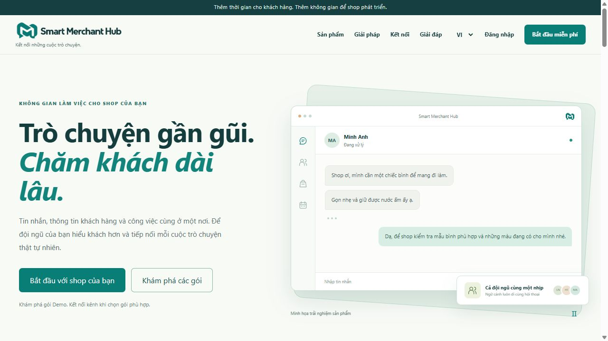
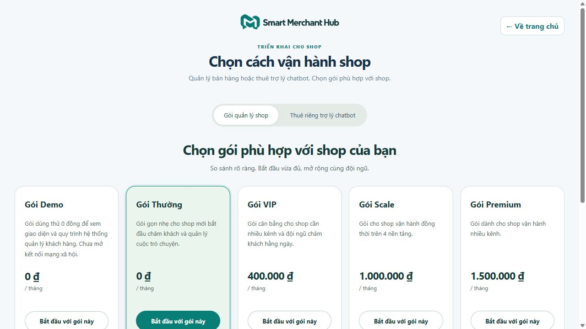
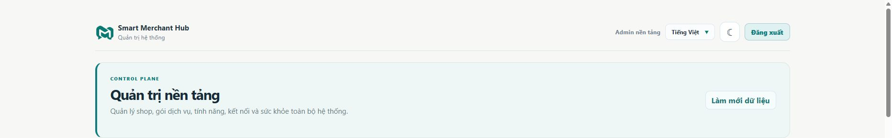

# Smart Merchant Hub

**Không gian quản lý khách hàng, bán hàng và trợ lý chatbot đa kênh cho shop.**

Smart Merchant Hub tập trung hội thoại, hồ sơ khách hàng, công việc và dữ liệu bán hàng vào một ứng dụng. Chủ shop và nhân viên làm việc trong workspace của shop; admin nền tảng quản lý shop, duyệt gói và theo dõi doanh thu trong khu vực riêng.

[Giao diện](#giao-diện-ứng-dụng) · [Chức năng](#chức-năng-chính) · [Chạy dự án](#chạy-dự-án-trên-windows) · [Gói và doanh thu](#luồng-đăng-ký-gói-và-doanh-thu) · [Tài liệu](#tài-liệu-chi-tiết)

## Giao diện ứng dụng

Ảnh chụp trực tiếp từ bản chạy local ngày 04/10/2026. Giá và số liệu là trạng thái tại thời điểm chụp, không phải cam kết cố định. Khung hội thoại trên trang giới thiệu là phần minh họa của landing page, không phải cuộc trò chuyện thật với khách hàng.

### Trang giới thiệu

Giới thiệu sản phẩm, các kênh kết nối và lối vào đăng ký/đăng nhập.



### Chọn gói dịch vụ

So sánh gói quản lý shop và dịch vụ thuê trợ lý chatbot. Danh mục, mức giá và hạn mức được quản lý ở phía admin.



### Dashboard admin nền tảng

Theo dõi shop, yêu cầu chờ duyệt, tình trạng kết nối và doanh thu gói. Dashboard phân biệt rõ **duyệt quyền sử dụng** với **xác nhận đã thu tiền**.



## Chức năng chính

| Khu vực | Chức năng |
| --- | --- |
| Hộp thư & khách hàng 360 | Hội thoại đa kênh, tìm kiếm/lọc, phân công, ghi chú nội bộ, nhãn và lịch sử tương tác; nhân viên có thể tiếp quản từ bot. |
| Vận hành shop | Sản phẩm, đơn bán/nhập hàng, luồng bán hàng, phiếu hỗ trợ, công việc, giờ phục vụ và quy tắc thời hạn. |
| Kho kiến thức & chatbot | Nạp tài liệu, tìm kiếm kết hợp từ khóa/vector, trả lời có nguồn, mẫu trả lời nhanh, bộ nhớ hội thoại và phản hồi chất lượng. |
| Tự động hóa & báo cáo | Quy trình theo sự kiện, lịch sử chạy/thử lại, follow-up, thông báo và báo cáo theo bộ lọc. |
| Tài khoản & bảo mật | Vai trò owner/admin/agent/viewer, phiên đăng nhập, xác minh email, nhật ký thao tác và kiểm tra quyền theo shop. |
| Admin nền tảng | Quản lý shop, gói/giá/hạn mức, yêu cầu đăng ký, thu tiền/hoàn tiền, cảnh báo kết nối và tách dữ liệu theo shop. |

### Các kênh kết nối

| Kênh | Cách kết nối / điều kiện |
| --- | --- |
| Facebook & Instagram | Meta OAuth và webhook; cần app Meta, quyền tương ứng, Facebook Page và tài khoản Instagram chuyên nghiệp liên kết. |
| Telegram | Bot của shop và cấu hình webhook/token. |
| Zalo | Zalo Bot Creator; cần thông tin bot và thiết lập theo hướng dẫn tích hợp. |
| TikTok & Shopee | Connector chạy trên máy người dùng, ghép nối với shop và dùng phiên đăng nhập nền tảng. Không phải tích hợp API chính thức tương đương Meta. |

**Logo hiển thị không có nghĩa kênh đã sẵn sàng nhận/gửi tin.** Cần cấu hình đúng, gói có quyền sử dụng và kiểm tra luồng thực tế. Khả năng gửi media khác nhau theo nhà cung cấp; phiên connector có thể hết hạn hoặc bị yêu cầu xác minh lại.

## Luồng đăng ký gói và doanh thu

1. Khách chọn **gói quản lý shop** hoặc **thuê trợ lý chatbot**, đăng ký và xác minh email. Backend lưu lựa chọn gói cùng loại dịch vụ.
2. Gói quản lý shop miễn phí có thể kích hoạt ngay theo logic onboarding. Gói trả phí và yêu cầu thuê chatbot đi vào trạng thái chờ duyệt.
3. Admin duyệt để cấp quyền/hạn mức. Thuê chatbot được xử lý riêng với gói CRM; nếu chưa có gói CRM hoạt động, hệ thống có thể cấp nền Demo để giữ đúng giới hạn.
4. Sau khi đối soát tiền thực nhận, admin **ghi nhận thanh toán** với mã tham chiếu. Backend kiểm tra gói, số tiền, loại tiền và tránh ghi trùng theo tham chiếu.
5. Dashboard tính các giao dịch VND đã xác nhận thu tiền, có theo dõi hoàn tiền. Thống kê tháng tính theo UTC.

> **Duyệt gói không tự cộng doanh thu; ghi nhận tiền không thay thế bước duyệt gói.** Quy trình hiện tại xác nhận thanh toán thủ công ở admin, không phải cổng thanh toán tự động hay webhook đối soát ngân hàng.

## Công nghệ và cấu trúc

| Thành phần | Công nghệ |
| --- | --- |
| Giao diện | Vue 3, Vite; tiếng Việt/tiếng Anh, sáng/tối |
| API | FastAPI, SQLAlchemy, Alembic |
| Dữ liệu | PostgreSQL + pgvector; database platform/tenant và kiểm tra cách ly theo shop |
| Công việc nền | Redis và worker CRM |
| Trợ lý kiến thức | RAG, hybrid retrieval, LLM/embedding cấu hình qua biến môi trường |
| Triển khai & kiểm tra | Docker Compose, pytest, Node test runner, GitHub Actions |

```text
Smart-Merchant-Hub/
├── frontend/                 # Vue và kiểm thử giao diện
├── backend/
│   ├── app/                  # API, auth, CRM, RAG và services
│   ├── alembic*/             # Migration CRM/platform/tenant
│   ├── scripts/              # Tạo admin, bảo mật và backup
│   └── tests/                # Kiểm thử backend
├── scripts/                  # Connector TikTok/Shopee và công cụ vận hành
├── docker/                   # Khởi tạo database và cấu hình Docker
├── docs/                     # Runbook, kiến trúc, QA và ảnh giao diện
├── docker-compose.yml        # Development
└── docker-compose.production.yml
```

## Chạy dự án trên Windows

### 1. Chuẩn bị

Cần Git và Docker Desktop đang chạy Linux containers; các cổng `5173`, `8000`, `5432` chưa bị chiếm. Chạy hoàn toàn bằng Docker không cần Node/Python trên máy. Khi chạy ngoài Docker, tham khảo Node 22 và Python 3.12 như cấu hình CI.

Clone và tạo cấu hình riêng, không ghi đè file đã có:

```powershell
git clone https://github.com/CaoDucManh1611/Smart-Merchant-Hub.git
Set-Location Smart-Merchant-Hub
docker info
if (-not (Test-Path '.env')) { Copy-Item '.env.example' '.env' }
if (-not (Test-Path 'backend\.env')) { Copy-Item 'backend\.env.example' 'backend\.env' }
```

### 2. Thiết lập môi trường

Mở `.env` ở gốc và thay giá trị mẫu:

```dotenv
POSTGRES_DB=crm_chatbot
POSTGRES_USER=crm_app
POSTGRES_PASSWORD=YOUR_LOCAL_PASSWORD
DATABASE_URL=postgresql+psycopg://crm_app:YOUR_LOCAL_PASSWORD@db:5432/crm_chatbot
```

Dùng cùng mật khẩu PostgreSQL trong hai dòng liên quan; nếu có ký tự đặc biệt, mã hóa URL phần mật khẩu trong `DATABASE_URL`. Trong Docker, host database là `db`, **không phải localhost**.

`backend/.env` chứa secret, SMTP, LLM, embedding và token kênh. Điền các biến cần thiết theo `backend/.env.example`; không dùng file này thay `.env` ở gốc cho Compose. Đăng ký gửi mã email cần SMTP hoạt động; chatbot và kênh mạng xã hội cần cấu hình provider tương ứng.

**Nếu đã có dữ liệu, giữ nguyên thông tin kết nối và tên project Compose đang dùng.** Đổi tên project có thể tạo volume mới khiến ứng dụng trông như mất dữ liệu dù volume cũ vẫn còn.

### 3. Khởi động

Ví dụ dùng project `smart-merchant-hub-runtime`; nếu đã triển khai bằng tên khác, thay bằng đúng tên đó trong tất cả lệnh:

```powershell
docker compose --env-file .\.env -p smart-merchant-hub-runtime up -d --build
docker compose --env-file .\.env -p smart-merchant-hub-runtime ps -a
Start-Process 'http://localhost:5173/'
```

| Địa chỉ local | Mục đích |
| --- | --- |
| http://localhost:5173/ | Giao diện ứng dụng |
| http://localhost:8000/docs | Tài liệu API tương tác |
| http://localhost:8000/health | Kiểm tra backend |

Lần đầu có thể mất vài phút để tải image, cài dependencies và áp dụng migration. Xem log:

```powershell
docker compose --env-file .\.env -p smart-merchant-hub-runtime logs --tail 100 db backend frontend worker
```

### 4. Tạo tài khoản đầu tiên

Trên database mới, đăng ký qua giao diện khi SMTP đã cấu hình, hoặc tạo chủ shop bằng script. Mật khẩu nhập ẩn, không đặt trong lệnh:

```powershell
docker compose --env-file .\.env -p smart-merchant-hub-runtime exec backend python scripts/create_admin.py --business-id 1 --email owner@example.com --name "Shop Owner"
```

Tạo admin nền tảng riêng bằng cờ `--platform-admin`:

```powershell
docker compose --env-file .\.env -p smart-merchant-hub-runtime exec backend python scripts/create_admin.py --business-id 1 --email platform@example.com --name "Platform Admin" --platform-admin
```

Email trên chỉ là ví dụ; chọn email và mật khẩu riêng. Script tạo tài khoản mới, không đổi mật khẩu tài khoản đã tồn tại. Không có mật khẩu admin dùng chung công bố trong README.

### 5. Cập nhật và bảo toàn dữ liệu

```powershell
git pull --ff-only origin main
docker compose --env-file .\.env -p smart-merchant-hub-runtime up -d --build
docker compose --env-file .\.env -p smart-merchant-hub-runtime exec backend python -m alembic current
```

Sao lưu trước khi cập nhật hệ thống đang vận hành. **Không dùng `docker compose down -v` nếu muốn giữ dữ liệu.** Không xóa database để cập nhật schema; dùng migration và runbook bên dưới.

## Kiểm thử và chất lượng

Frontend, chạy từ thư mục gốc:

```powershell
Set-Location frontend
npm ci
npm test
npm run build
```

Backend, chạy từ thư mục gốc với dependencies trong `backend/requirements.txt` và môi trường kiểm thử riêng; không dùng database vận hành:

```powershell
Set-Location backend
python -m pytest tests -q
```

Mốc kiểm chứng của PR [#9](https://github.com/CaoDucManh1611/Smart-Merchant-Hub/pull/9), ngày 04/10/2026: **866 test backend đạt, 6 test bỏ qua trong môi trường local; 222 test frontend đạt**. CI kiểm tra thêm migration/model drift, cách ly PostgreSQL, khởi động Compose và build Docker image. Đây là kết quả tại mốc đó, không phải bảo đảm mọi tích hợp bên ngoài luôn hoạt động.

## Cấu hình nâng cao

### Meta OAuth và webhook

Cấu hình trong `backend/.env` theo app Meta của bạn:

```dotenv
META_APP_ID=YOUR_META_APP_ID
META_APP_SECRET=YOUR_META_APP_SECRET
META_GRAPH_VERSION=v26.0
META_OAUTH_REDIRECT_URI=https://YOUR_PUBLIC_DOMAIN/api/oauth/meta/callback
FRONTEND_BASE_URL=http://localhost:5173
FACEBOOK_VERIFY_TOKEN=YOUR_PRIVATE_VERIFY_TOKEN
```

Thêm đúng Redirect URI trong Meta Developer và dùng callback webhook `https://YOUR_PUBLIC_DOMAIN/api/webhooks/facebook`. Bắt đầu từ **Kết nối mạng xã hội** trong ứng dụng. Quyền truy cập, token và đăng ký webhook phụ thuộc cấu hình/quyền được Meta cấp.

### Kho kiến thức, chatbot và media

- Tài liệu chia theo cấu trúc/đoạn văn và giữ văn bản gốc. Nếu có `GEMINI_API_KEY` hoặc `GEMINI_API_KEYS`, hệ thống có thể dùng Gemini chọn ranh giới ngữ nghĩa; thiếu key, lỗi hoặc hết quota thì chia cục bộ. Mỗi nhóm tối đa 16 đoạn/8.000 ký tự, tối đa 32 lượt cho một tài liệu. Không tự reindex dữ liệu cũ.
- `GROQ_API_KEYS`, `LLM_API_KEYS`, `EMBEDDING_API_KEYS` hỗ trợ danh sách key, xoay vòng và tạm ngưng key lỗi; không ghi raw key vào log.
- Media lưu và kiểm tra quyền theo shop. Để provider tải media local, backend cần HTTPS công khai và `PUBLIC_BASE_URL` đúng. Xem giới hạn từng kênh trong [backend runbook](backend/README.md).
- Worker xử lý công việc nền, gồm follow-up. Kiểm tra cấu hình/lịch dispatch trước khi dùng chăm sóc tự động.

Các endpoint chatbot tiêu biểu: `/api/chatbot/config`, `/api/chatbot/canned-responses`, `/api/chatbot/followups`, `/api/chatbot/csat`; nhân viên có thể pause/resume bot theo hội thoại. Contract chi tiết nằm trong API docs của bản triển khai.

## Bảo mật và giới hạn triển khai

- Không commit `.env`, API key, token, cookie, phiên connector hoặc database dump chứa dữ liệu thật.
- GitHub chứa mã nguồn và tài nguyên ứng dụng, **không chứa cấu hình riêng hay toàn bộ dữ liệu shop trên máy bạn**. Chuyển dữ liệu bằng backup/restore riêng.
- Production cần secret ngẫu nhiên mạnh, HTTPS, CORS/allowed hosts cụ thể, rate limit và kiểm tra phân quyền. Không dùng cấu hình development cho hệ thống công khai.
- Quyền theo tenant và tách database/schema có các bước triển khai riêng; đọc runbook trước khi chuyển shop sang kho dữ liệu riêng.
- Connector trình duyệt phụ thuộc phiên đăng nhập và thay đổi giao diện TikTok/Shopee; cần giám sát và kiểm tra lại khi nền tảng thay đổi.

## Tài liệu chi tiết

| Tài liệu | Nội dung |
| --- | --- |
| [Backend runbook](backend/README.md) | API, media, CRM và tài khoản |
| [Tích hợp dữ liệu CRM](docs/crm-data-integrations.md) | Nguồn và kết nối dữ liệu |
| [Mẫu import](docs/crm-ui-import-templates.md) | Template nhập dữ liệu |
| [Production Compose](docs/runbooks/production-compose.md) | Triển khai production |
| [Bảo mật production](docs/production-security-runbook.md) | Secret, phân quyền và kiểm tra bảo mật |
| [Bảo mật SaaS](docs/saas-security-runbook.md) | Vận hành nhiều shop |
| [Migration tenant](docs/runbooks/tenant-migration.md) | Di chuyển/cập nhật dữ liệu tenant |
| [Backup & restore tenant](docs/runbooks/tenant-backup-restore.md) | Sao lưu và phục hồi |
| [Checklist phát hành](docs/release-checklist.md) | Kiểm tra trước bàn giao |

Khi chạy backend trực tiếp, entry point là `uvicorn app.main:app --reload` từ thư mục `backend`, không phải `uvicorn main:app`.
